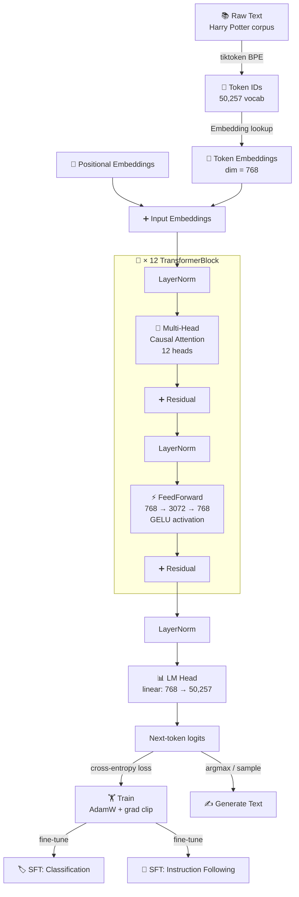
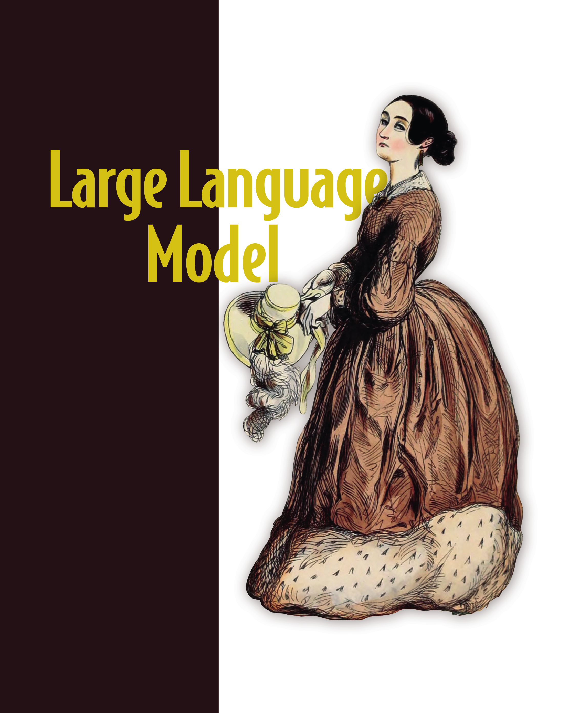

# Lecture 0 — Welcome to GPT from Scratch

---

> *"I hear and I forget. I see and I remember. I do and I understand."*
> — Confucius

---

## Before We Write a Single Line of Code

Stop. Don't open a notebook yet.

This lecture exists because **Module 5 is different** from everything you have done so far. Not harder in the sense of more syntax to memorize — harder in the sense that you are about to build something that most people only interact with as a black box. You are going to look inside the machine that powers ChatGPT, GitHub Copilot, and Claude, and build your own version of it from a blank file.

That deserves a moment of orientation before you start.

---

## The One Idea That Explains Everything

Here is a sentence with a word missing:

```
The cat sat on the _____
```

You immediately know the answer is *mat*, or *floor*, or *chair* — something you sit or rest on. You know this not because you memorized this sentence, but because you have read millions of sentences and absorbed the statistical patterns of the English language.

**That is exactly what a language model does.**

It reads enormous amounts of text, learns the patterns, and learns to predict: *given everything I have seen so far, what word comes next?*

That is the entire objective:

```
P(next token | all previous tokens)
```

One probability distribution. Trained on enough text, this simple objective produces a model that can write, reason, code, translate, and converse. Everything else — ChatGPT, Copilot, Claude — is built on top of this foundation.

In this module, you build that foundation.

---

## "But I Could Just Use HuggingFace"

Yes. You could write this:

```python
from transformers import AutoModelForCausalLM, AutoTokenizer
model = AutoModelForCausalLM.from_pretrained("gpt2")
```

And you would have GPT-2. In two lines.

But you would not know:
- Why the attention mask is triangular
- What happens inside a transformer block at every forward pass
- Why the model sometimes confidently generates nonsense
- How to debug training when your loss stops decreasing
- What to change when you want to adapt the architecture
- Why fine-tuning works at all

When something breaks in production — and it will break — you need to understand what is happening inside the model, not just how to call it.

**We are not learning GPT to use GPT. We are learning GPT to understand intelligence.**

---

## The Big Picture: What Is a GPT?

GPT stands for **Generative Pre-trained Transformer**. Let's break each word down:

| Word | Meaning |
|---|---|
| **Generative** | It generates new text, one token at a time |
| **Pre-trained** | It was trained on a massive corpus before any specific task |
| **Transformer** | It uses the transformer architecture — the thing you are about to build |

The transformer was introduced in 2017 in a paper titled *"Attention Is All You Need"* (in your `Resources/` folder). Before it, language models used recurrent networks that processed text one word at a time — slow, forgetful, limited. The transformer processes the entire sequence at once and uses **attention** to decide which tokens matter for predicting the next one.

It was not a small improvement. It was the architecture that unlocked the modern era of AI.

---

## How a Transformer Actually Thinks

Forget the math for a moment. Here is the intuition.

Imagine you are reading this sentence:

```
The animal didn't cross the street because it was too tired.
```

What does *it* refer to? The animal, not the street. You know this because *tired* relates to animals, not streets. Your brain made a connection across a distance of 7 words.

Attention is the mechanism that gives a transformer the same ability. For every word it wants to predict, it asks: **which other words in this context are most relevant right now?**

```
"it" is attending to...

The    animal    didn't    cross    the    street    because    it
 ▲       ▲▲▲                                            
 │       ║                                               
 │       ║  ← HIGH attention (animal = subject)          
 │       ║                                               
 └───────╜  ← low attention (The = article, less informative)
```

It does this for every token, simultaneously, across the entire sequence. That is the core insight.

---

## What You Are Actually Building

Here is the complete architecture you will implement over 6 lectures:



Every box in that diagram is something you will implement yourself. No wrappers.

---

## The Journey: 7 Lectures

Think of this module as building a car from parts. You do not start with the full car. You start with the wheels.

```
WEEK 1                    WEEK 2                    WEEK 3
┌────────────────┐        ┌────────────────┐        ┌────────────────┐
│  1. DATA       │        │  3. GPT        │        │  5. TRAIN_Pro  │
│                │   ──►  │                │   ──►  │                │
│  Text → tokens │        │  The full arch │        │  LR schedules  │
│  Sliding window│        │  124M params   │        │  Grad accum    │
│  DataLoader    │        │                │        │                │
└────────────────┘        └────────────────┘        └────────────────┘
        │
        ▼
┌────────────────┐        ┌────────────────┐        ┌────────────────┐
│  2. ATTENTION  │        │  4. TRAIN      │        │  6 & 7. SFT    │
│                │   ──►  │                │   ──►  │                │
│  Q, K, V       │        │  Loss + AdamW  │        │  Classify text │
│  Causal mask   │        │  Generation    │        │  Follow instr  │
│  Multi-head    │        │  Checkpointing │        │                │
└────────────────┘        └────────────────┘        └────────────────┘
```

### What you will feel at the end of each lecture

**After Lecture 1 (DATA)** — *"I understand why tokenization matters and why models have a fixed vocabulary."*

**After Lecture 2 (ATTENTION)** — *"I can derive the attention formula on paper and explain every operation. I know why GPT can't see the future."*

**After Lecture 3 (GPT)** — *"I just instantiated a 124-million-parameter model I wrote myself. I can count every parameter and explain every design choice."*

**After Lecture 4 (TRAIN)** — *"My model just generated Harry Potter text. I trained it from scratch. I watched the loss go down."*

**After Lectures 6 & 7 (SFT)** — *"I fine-tuned my own LLM for a real task. I understand how ChatGPT is built."*

---

## Why This Module, Why Now

You have been building toward this.

- **Module 3** taught you backpropagation by hand. That knowledge lives inside every gradient update here.
- **Module 4** gave you PyTorch fluency. You already know how to write training loops, DataLoaders, and `nn.Module` classes.
- **Module 4's HuggingFace section** showed you what fine-tuned transformers can do. Now you will understand *how* they do it.

This is not a detour. This is the destination.

The reason LLMs feel like magic to most people is that most people have never seen inside one. You are about to see inside one — and build it.

---

## The Textbook

This module runs alongside a book:

<div align="center">



**Build a Large Language Model (From Scratch)**
*Sebastian Raschka · Manning, 2024*

</div>

Each lecture maps to a chapter. **Read the chapter before the notebook.** The book explains the *why*. The notebook is where you build the *what*.

| Notebook | Chapter |
|---|---|
| `1.DATA` | Ch. 2 — Working with text data |
| `2.ATTENTION` | Ch. 3 — Coding attention mechanisms |
| `3.GPT` | Ch. 4 — Implementing a GPT model from scratch |
| `4.TRAIN` | Ch. 5 — Pretraining on unlabeled data |
| `6.SFT_Text_Classification` | Ch. 6 — Fine-tuning for classification |
| `7.SFT_Instruction_Following` | Ch. 7 — Fine-tuning to follow instructions |

Also in `Resources/`: **Attention Is All You Need** (Vaswani et al., 2017). Read it alongside Lecture 2. It is six pages. Every equation you implement maps directly to this paper.

---

## What You Need Before Starting

A quick honest checklist. These are not soft suggestions:

- [ ] **PyTorch `nn.Module`** — you can write a custom layer class without looking anything up
- [ ] **Training loops** — you understand what forward → loss → backward → step does
- [ ] **Matrix multiplication** — you can explain what `(B, T, d) @ (d, V)` produces
- [ ] **Module 4 complete** — specifically the HuggingFace and CNN sections
- [ ] **The book** — open `Resources/raschka_llm_from_scratch.pdf` now, start Chapter 1 tonight

If any of those feel uncertain, spend a day in Module 4's PyTorch Fundamentals section before continuing. An hour of review now saves three hours of confusion later.

---

## The Corpus: Harry Potter

One more thing before you start. The training data for your language model is all 7 Harry Potter books, already preprocessed and waiting for you:

```
data/
├── train_ids.bin    ← 1,909,741 tokens  (90%)
├── val_ids.bin      ←   148,424 tokens   (7%)
└── test_ids.bin     ←    61,209 tokens   (3%)
```

~2.1 million tokens of rich narrative prose. Enough to train a small language model that generates coherent, HP-flavored English.

Why Harry Potter? Because it is:
- Long enough to provide meaningful training signal
- Stylistically consistent (same author, same world)
- Familiar enough that you will immediately recognize quality generations
- Already in your repo — no downloads, no setup

---

## How to Use This Module

```
For each lecture:

1. Read the textbook chapter  (30–60 min)
2. Open the notebook          (do not skim — type every cell)
3. Run it. Break it. Fix it.  (the errors are part of the learning)
4. Do the exercises           (Resources/raschka_llm_exercises.pdf)
5. Close the notebook, open a blank file, rebuild from memory
```

Step 5 is the one most people skip. It is the most important one.

You do not really understand attention until you can write it from scratch without looking at your notes. The notebook is the scaffold. The blank file is the test.

---

## Let's Go

You are about to do something that very few people in the world have done: build a large language model from first principles, understand every design decision, and train it on real data.

It will be difficult. There will be moments where the matrix dimensions don't line up, the loss doesn't go down, and the generated text looks like gibberish. Those are not failures — they are exactly the moments where the understanding gets built.

Open `Resources/raschka_llm_from_scratch.pdf`. Read Chapter 1.

Then open `1.DATA.ipynb`.

---

<div align="center">

*No shortcuts. No pretrained weights. No from_pretrained.*
*Just you, PyTorch, and 124 million parameters you built yourself.*

</div>
